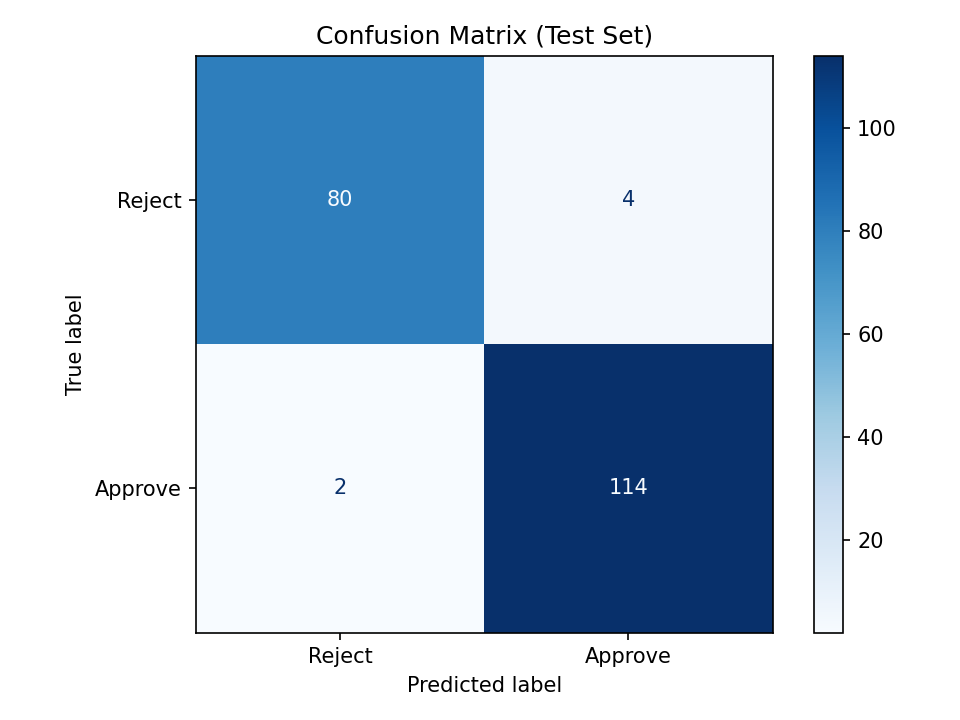
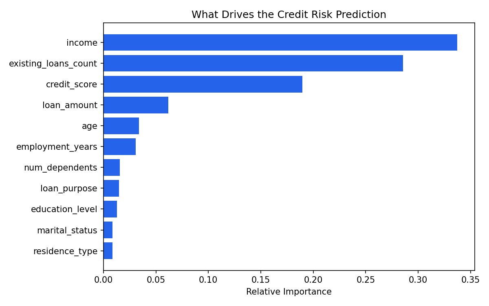

# Credit Risk Scoring Engine

**A model that predicts loan default risk from applicant data — 97% accuracy, 0.997 AUC — with a live scoring interface for loan officers.**

[🔗 Live Demo](#) · [🎥 60-second walkthrough](#)

---

## The Business Problem

Lenders lose money two ways: approving loans that default, and rejecting applicants who would have repaid. Manual underwriting is slow and inconsistent across officers. This project builds a model that scores an applicant's default risk in real time, giving loan officers a consistent, data-backed second opinion alongside their own judgment — not a replacement for it.

## Data

This model is trained on a **synthetic dataset of 1,000 applicant records** (age, income, loan amount, credit score, employment history, and 6 other features), built to demonstrate the full modeling pipeline in the absence of access to proprietary bank data. The methodology — feature engineering, model selection, evaluation, deployment — is directly transferable to a real lending dataset; the specific numbers below describe this dataset, not real-world default rates.

## Approach

- **Model:** Random Forest Classifier (100 estimators)
- **Preprocessing:** Categorical encoding + standard scaling, defined once in `config.py` and shared between training and inference so the two never drift out of sync
- **Split:** 80/20 train-test, stratified

## Results

| Metric | Score |
|---|---|
| Accuracy | 97% |
| Precision (approved class) | 97% |
| Recall (approved class) | 98% |
| **AUC-ROC** | **0.997** |



### What actually drives the prediction



**Business read:** the model has effectively learned the same three signals a human underwriter would prioritize — capacity to repay (income), current debt load (existing loans), and repayment history (credit score) — with income mattering nearly twice as much as credit score alone. This is a useful sanity check: the model isn't relying on a spurious or unintuitive feature, which builds confidence it would generalize reasonably if retrained on real applicant data.

## Live Application

The Streamlit app takes 11 applicant inputs and returns an instant approve/reject prediction with a confidence score and a plain-language "why" explanation, intended as a co-pilot for a loan officer rather than an autonomous decision-maker.

## Project Structure

```
config.py            # single source of truth for categorical encodings
train_model.py        # trains the model, evaluates it, generates the charts above
app.py                 # Streamlit inference app
credit_model.pkl       # trained model (generated by train_model.py)
scaler.pkl             # fitted scaler (generated by train_model.py)
dummy_credit_data.csv  # synthetic training data
```

## Known Limitations (and what I'd fix with more time)

Being upfront about this matters more than pretending it's finished:
- Trained on synthetic, not real, lending data — performance would need re-validation on production data before any real deployment
- No SHAP-based per-prediction explainability yet — the current "why" panel is a static summary of global feature importance, not a per-applicant breakdown
- No fairness/bias audit across protected characteristics — a real requirement before any lending model goes to production

## Tech Stack

Python · scikit-learn · Streamlit · pandas · matplotlib · joblib

## What's Next

Adding a natural-language explanation layer (LLM-generated, per-prediction) so a loan officer sees not just a score but a plain-English reason — e.g. *"Flagged high-risk primarily due to low income relative to loan amount and two existing loans."*
